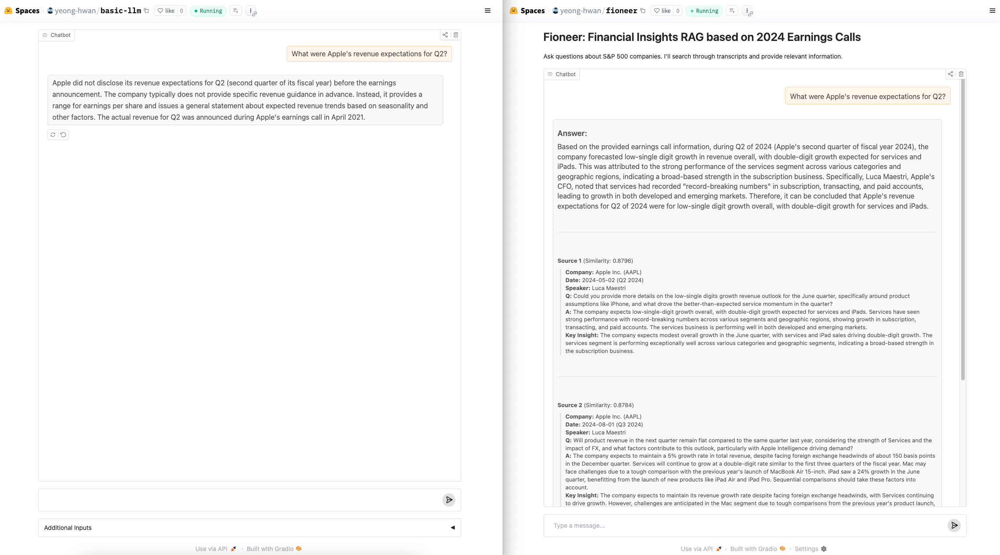
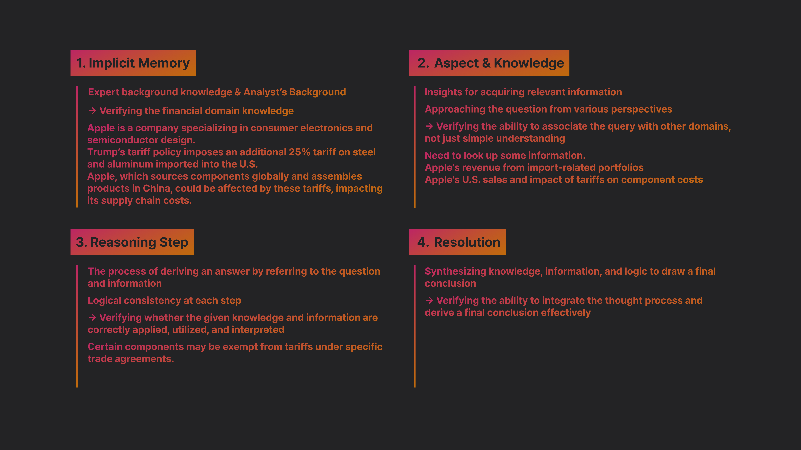
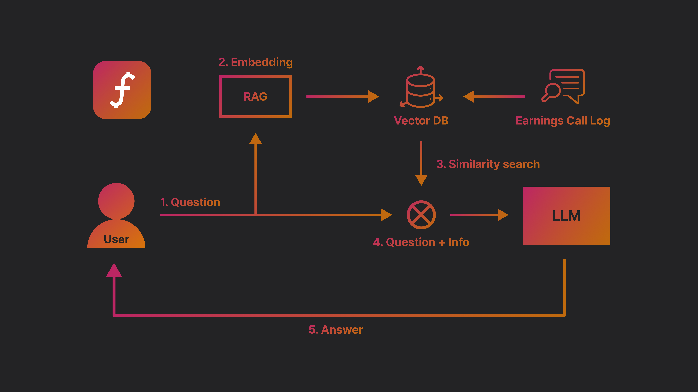

<p align="center">
  <a href="https://github.com/yeong-hwan/fioneer" title="fioneer">
    
  </a>
</p>

## Demo

<p align="center">
  
</p>

Try our demo on Hugging Face Spaces: [Fioneer Demo](https://huggingface.co/spaces/yeong-hwan/fioneer)


### Install

```bash
poetry install

source .venv/bin/activate  # Mac/Linux
.venv\Scripts\activate     # Windows
```

### Analysis Steps

> How will the recent U.S. tariff policy impact Apple's business outlook?

<p align="center">
  
</p>

## RAG Flow

<p align="center">
  
</p>

## dataset

```json
{
  "id": 1,
  "ticker": "NVDA",
  "year": 2024,
  "quarter": 4,
  "date": "2024-11-20",
  "sector": "Technology",
  "industry": "Semiconductors",
}
```

### Ticker Sector Industry

[huggingface](https://huggingface.co/datasets/yeong-hwan/ticker_sector_industry)


### sector
- Basic Materials
- Communication Services
- Consumer Cyclical
- Consumer Defensive
- Energy
- Financial Services
- Healthcare
- Industrials
- Real Estate
- Technology
- Utilities

## Scripts

### ninjas

API Document: https://api-ninjas.com/api/earningscalltranscript

The project contains several Python scripts in the `scripts/` directory for data collection, processing, and analysis of earnings call transcripts.

### Data Collection Scripts

#### `ticker_fetcher.py`
- Fetches the S&P 500 company tickers from Wikipedia
- Saves the ticker list to `data/processed/ticker_list.json`
- Usage: `python scripts/ticker_fetcher.py`

#### `fetch_company_info.py`
- Retrieves detailed company information using yfinance API
- Collects data like company name, country, sector, and industry
- Saves company information to `data/processed/company_info.csv`
- Usage: `python scripts/fetch_company_info.py`

### Earnings Call Processing

#### `earnings_to_csv.py`
- Downloads earnings call transcripts using the Ninjas API
- Processes transcripts into structured CSV format
- Features:
  - Parses speaker and content from transcripts
  - Saves individual transcripts to `data/processed/transcripts/`
  - Creates earnings dates mapping in `data/processed/earnings_dates.json`
- Usage: `python scripts/earnings_to_csv.py`

#### `metadata_extractor.py`
- Advanced transcript analysis using LLM (OpenAI)
- Key features:
  - Extracts Q&A structure from transcripts
  - Summarizes questions and answers
  - Generates business insights and reasoning steps
  - Processes transcripts in parallel for efficiency
- Output:
  - Creates metadata files in `data/processed/metadata/`
  - Each metadata file contains:
    - Company information (ticker, sector, industry)
    - Q&A summaries
    - Business insights
    - Reasoning steps
- Usage: `python scripts/metadata_extractor.py`

### Data Structure

```
data/
├── processed/
│   ├── ticker_list.json         # List of company tickers
│   ├── company_info.csv         # Company details
│   ├── earnings_dates.json      # Mapping of earnings call dates
│   ├── transcripts/             # Individual transcript CSVs
│   └── metadata/               # Processed metadata JSON files
```

### Processing Flow

1. Fetch company tickers (`ticker_fetcher.py`)
2. Get company information (`fetch_company_info.py`)
3. Download and process earnings calls (`earnings_to_csv.py`)
4. Extract insights and metadata (`metadata_extractor.py`)

### Example Output

#### Company Information (company_info.csv)
```csv
Ticker,Company,Country,Sector,Industry
AAPL,Apple Inc.,United States,Technology,Consumer Electronics
MSFT,Microsoft Corporation,United States,Technology,Software - Infrastructure
GOOGL,Alphabet Inc.,United States,Communication Services,Internet Content & Information
```

#### Earnings Dates (earnings_dates.json)
```json
{
    "aapl_2024_Q1": "2024-02-01",
    "aapl_2024_Q2": "2024-05-02",
    "aapl_2024_Q3": "2024-08-01",
    "aapl_2024_Q4": "2024-10-31"
}
```

#### Ticker List (ticker_list.json)
```json
[
    "AAPL",
    "MSFT", 
    "GOOGL",
    "AMZN",
    "META"
]
```

#### Metadata Example (AAPL_2024_Q2.json)
```json
[
  {
    "company": "Apple Inc.",
    "country": "United States",
    "ticker": "AAPL",
    "date": "2024-05-02",
    "year": 2024,
    "q": 2,
    "sector": "Technology",
    "industry": "Consumer Electronics",
    "q_speaker": "Richard Kramer",
    "a_speaker": "Luca Maestri",
    "question_summary": "Are you prioritizing maintaining high margins or focusing on spurring growth to reach a net neutral cash position?",
    "answer_summary": "The company has experienced a strong dollar over a long period, impacting reported results as over 60% of revenue comes from abroad. Despite this, demand for products in international markets is robust due to currency translation. The company continues to invest in innovations, financing solutions, and trading programs to support its growth.",
    "insight": "Despite facing challenges with a strong dollar impacting reported results, the company's focus on innovation, financing solutions, and trading programs remains strong to support continued growth and investments.",
    "reasoning_steps": [
      "1. Company sells more than 60% of its revenue outside the United States.",
      "2. The company has been impacted by a long period of a strong dollar.",
      "3. Despite strong demand for products in international markets, results in dollars may not fully reflect this due to currency translation effects."
    ]
  },
  {
    "company": "Apple Inc.",
    "country": "United States",
    "ticker": "AAPL",
    "date": "2024-05-02",
    "year": 2024,
    "q": 2,
    "sector": "Technology",
    "industry": "Consumer Electronics",
    "q_speaker": "Atif Malik",
    "a_speaker": "Tim Cook",
    "question_summary": "What are the top two or three use cases generating the most excitement for Vision Pro in the enterprise segment?",
    "answer_summary": "The company is experiencing a wide range of use cases with its product across various industries, including field service, training, healthcare, control centers, and more. They are focused on growing their ecosystem, increasing the number of apps, and engaging more enterprises. The recent event showcased significant enthusiasm for their enterprise solutions.",
    "insight": "Vision Pro has a wide range of use cases across different industries in enterprise, and there is significant enthusiasm and engagement from enterprises during recent events.",
    "reasoning_steps": [
      "1. Vision Pro is being used across various verticals in enterprise.",
      "2. Use cases include field service, training, healthcare (such as preparing doctors for surgeries), and advanced imaging.",
      "3. The focus is on growing the ecosystem, getting more apps, and engaging more enterprises."
    ]
  }
]
```
